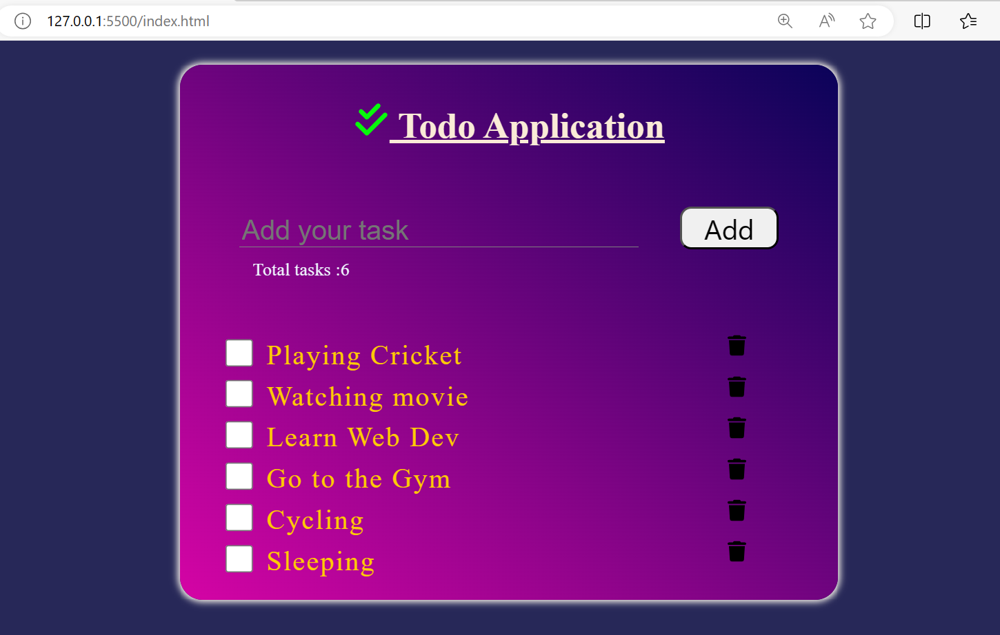

# ToDo Application

A simple ToDo application where users can list out all their tasks that needs to be done. This project is for beginners friendly as well. 

## Our Application Look

**Screenshots**

## Technologies Used

- HTML5
- CSS3 (Along with media queries)
- JavaScript (Vanilla)
- External Library: Font Awesome

## Key Features

1. **Task Addition:**
   - Users can add tasks using the Enter key from the keyboard or by clicking the "Add" button on the UI.

2. **Responsive Design:**
   - The UI is responsive and has a sleek design, ensuring a seamless user experience across devices.

3. **Dynamic Task Display:**
   - Tasks are added dynamically at runtime, providing a smooth and efficient user interaction.

4. **Delete Functionality:**
   - Users can delete any task that has been added with the built-in delete feature.

5. **Task Completion:**
   - Tasks can be marked as complete by clicking the checkbox next to each task, implementing the ToggleTask feature.

6. **Real-time Task Counter:**
   - The application includes a TaskCounter feature that displays the real-time updated count of tasks added to the UI.

## Intended Audience

This project is intended for learning purposes, especially for students who wish to create similar projects. Contributors interested in adding new functionalities are welcome to reach out with their ideas and contributions.

## Installation

To run the application locally, follow these steps:

1. Clone this repository to your local machine.
2. Open the `index.html` file in your web browser.
3. Start adding and managing your tasks!

## Contact

For questions, feedback, or collaboration opportunities, feel free to contact the project maintainer:

- Name: [AnkitTiwari10197]
- Email: [ankittiwariiit@gmail.com]

